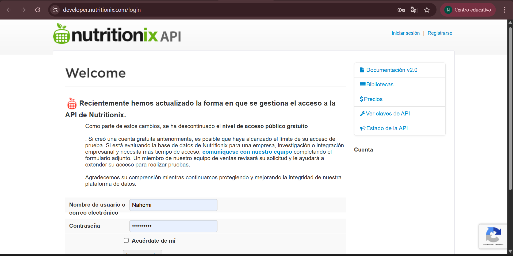
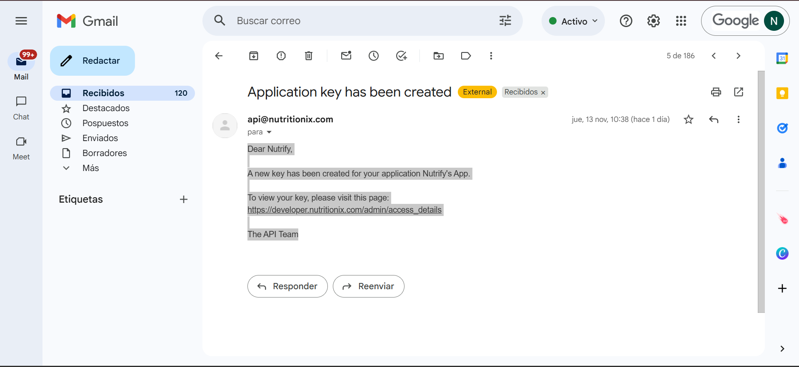

  
  

## 🔄 Cambio de API en el proyecto

Decidimos cambiar de API debido a que la que seleccionamos inicialmente descontinuó su opción gratuita, lo que imposibilitó continuar usándola en el proyecto.  
Después de investigar varias alternativas, elegimos FoodData Central ya que ofrece acceso público, una base de datos amplia y documentación clara.  
Por estas razones, consideramos que era la mejor opción para continuar trabajando.

